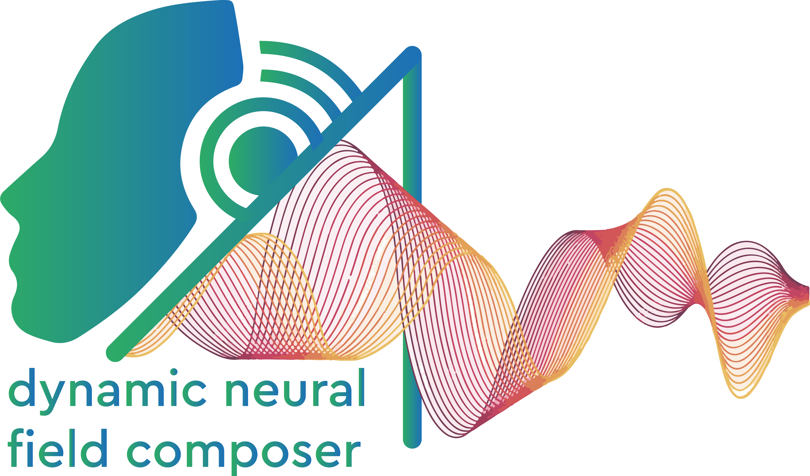

Dynamic Neural Field Composer - C++ application designed for developing Dynamic Neural Field Architectures.
===============================================


## Project Dependencies

The uses the following dependencies, which are installed for you when running the `build.bat` file. However, you must have defined the `VCPKG_ROOT` directory.

- [CMake](https://cmake.org/)
- [VCPKG](https://github.com/microsoft/vcpkg)
- [Catch2](https://github.com/catchorg/Catch2) (installed automatically via `build.bat`)
- [Imgui](https://github.com/ocornut/imgui) (installed automatically via `build.bat`)
- [Implot](https://github.com/epezent/implot) (installed automatically via `build.bat`)

## Building the Project

The `build.bat` script streamlines the build process:

1. Checks for the presence of the `VCPKG_ROOT` environment variable.
2. Installs Catch2, Imgui, and Implot using Vcpkg.
3. Integrates Vcpkg.
4. Creates build folders for x64-release and x64-debug configurations.
5. Runs CMake to generate build files for x64-release and x64-debug.
6. Builds the project for Release configuration.
7. Builds the project for Debug configuration.

## Installing the Project

Use the `install.bat` script to install the built artifacts. Ensure you run it with administrator privileges. The script performs the following:

1. Creates install folders for x64-release and x64-debug configurations.
2. Installs the x64-release configuration.
3. Installs the x64-debug configuration.

## Integration into Your CMake Project

To integrate Dynamic Neural Field Composer into your CMake project:

1. In your project's CMakeLists.txt file, add the following lines to find and link against Dynamic Neural Field Composer:

    ```cmake
    find_package(dynamic-neural-field-composer REQUIRED)

    # Your project target
    add_executable(your_target src/main.cpp)

    # Link against Dynamic Neural Field Composer
    target_link_libraries(your_target PRIVATE dynamic-neural-field-composer)
    ```
    
